# COMPLETE PROJECT REPORT
## FARM2MARKET — Direct Farmer to Customer Marketplace (PHP + MySQL)

### ACKNOWLEDGEMENT (Page I)
I express my sincere gratitude to my project guide and faculty members for their valuable guidance and continuous support throughout this project. I also thank my friends and family for encouraging me during the development and documentation of this work.

### SYNOPSIS (Page II)
**Farm2Market** is a role-based web application that connects farmers directly with customers to enable transparent pricing, faster access to fresh produce, and reduction of middlemen. The system provides three dedicated interfaces (Admin, Farmer, Customer) with secure authentication, product listing with administrative approval, marketplace browsing with filters, ordering with inventory locking, and order-status tracking.

The project is implemented using **PHP (PDO)**, **MySQL (XAMPP/MariaDB)**, and a responsive UI built with **HTML/CSS/JS**. It runs on a local machine or LAN environment and supports data seeding for demo/testing.

---

## CONTENTS

| CHAPTER | TITLE | PAGE NO. |
|---:|---|---:|
|  | ACKNOWLEDGEMENT | I |
|  | SYNOPSIS | II |
| 1 | INTRODUCTION | 01 |
|  | 1.1 About the Project | 01 |
|  | 1.2 Hardware Specifications | 02 |
|  | 1.3 Software Specifications | 03 |
| 2 | SYSTEM ANALYSIS | 04 |
|  | 2.1 Problem Definition | 04 |
|  | 2.2 System Study | 05 |
|  | 2.3 Proposed System | 06 |
| 3 | SYSTEM DESIGN | 08 |
|  | 3.1 Data Flow Diagram (DFD) | 08 |
|  | 3.2 Entity Relationship Diagram | 09 |
|  | 3.3 File Specifications | 10 |
|  | 3.4 Module Specifications | 14 |
| 4 | TESTING AND IMPLEMENTATION | 16 |
|  | 4.1 System Testing | 16 |
|  | 4.2 Implementation | 18 |
| 5 | CONCLUSION AND SUGGESTIONS | 20 |
|  | 5.1 Conclusion | 20 |
|  | 5.2 Suggestions for Future Enhancement | 20 |
|  | BIBLIOGRAPHY | 21 |
|  | APPENDICES | 22 |
|  | APPENDIX – A (SCREEN FORMATS) | 22 |
|  | APPENDIX – B (REPORT FORMS) | 26 |

---

## CHAPTER 1 — INTRODUCTION (Page 01)

### 1.1 About the Project (Page 01)
Farm2Market is a web-based direct marketplace system that establishes a controlled and transparent link between three participant roles: the Farmer who publishes agricultural products and manages inventory, the Customer who explores approved items and places orders with delivery details, and the Administrator who moderates listings, manages user access, monitors overall transactions, and produces analytical exports. The main intention of the project is to reduce dependency on intermediaries by providing a structured platform where the product information, order flow, and fulfilment status remain digitally traceable, thereby improving fairness, speed of communication, and operational accountability.

#### OBJECTIVES OF THE PROJECT
The objective of Farm2Market is to provide a secure role-based environment where farmers can list products with essential parameters such as category, price, stock quantity, description, and product image, while customers can browse verified products using search and category filters and complete procurement by submitting quantity requirements and delivery address information. Another key objective is to empower administrators with moderation controls so that product listings follow an approval pipeline (pending, approved, rejected), and to enable system-level management such as blocking or activating users, supervising orders, and exporting reports for sales and inventory distribution. Additionally, the system aims to maintain correct stock values by using transaction-safe updates during order placement and by restoring inventory when cancellations are allowed.

#### SCOPE OF THE PROJECT
The scope of the system covers authentication and session management for Admin, Farmer, and Customer roles, product lifecycle management for farmers (create, update, delete) with an approval workflow enforced by admins, customer marketplace operations (browse, search, view details, place order), and order tracking through a defined status pipeline. The scope also includes administrative controls for user management and logistics oversight, along with reporting features that generate CSV exports for sales summaries, category distribution, and user activity states. The project is intended to run reliably on a local XAMPP-based environment, making it suitable for institutional labs or LAN deployments.

---

### 1.2 Hardware Specifications (Page 02)
The application is optimized to run on standard institutional hardware without requiring specialized servers. The recommended configuration used for development and execution is as follows.

Processor	:	Intel(R) Core (TM) i5-8500 @ 3.00 GHz  
RAM		:	8 GB  
Hard Disk	:	256 GB SSD  
Monitor		:	19.5" Monitor  
Mouse		:	Logitech Mouse  
Keyboard	:	Logitech Keyboard  

---

### 1.3 Software Specifications (Page 03)
The project is built on the PHP–MySQL–Apache stack, using XAMPP for local deployment. The software requirements for running and maintaining the system are listed below.

Operating System	:	Windows 11  
Web Server		:	Apache HTTP Server  
Backend Language	:	PHP  
Database		:	MySQL  
Frontend Stack		:	HTML5, CSS3, JavaScript (Latest Standards)  
Local Dev Stack		:	XAMPP  
Browser			:	Chrome / Firefox / Edge  

---

## CHAPTER 2 — SYSTEM ANALYSIS (Page 04)

### 2.1 Problem Definition (Page 04)
In many local agricultural markets, farmers often depend on intermediaries to reach customers, and this dependency reduces the farmer’s profit share while also making the final pricing less transparent to the customer. Customers may not have direct visibility into the origin, availability, and pricing logic of produce, and farmers may not have reliable visibility into demand. As a result, order fulfilment becomes slower, communication becomes fragmented, and there is limited accountability when disputes occur. The core problem addressed by this project is to design and implement a simple, secure, and moderated digital system that can operate locally and enable direct transactions between farmers and customers while keeping records of listings, orders, and fulfilment status.

#### EXISTING SYSTEM
In the existing approach, agricultural procurement is largely handled through phone calls, physical marketplaces, brokers, or informal messaging, where product availability and pricing are communicated verbally and may change without proper tracking. Farmers maintain stock information manually, customers search for produce by visiting multiple vendors, and there is no unified repository that records product parameters, order requests, delivery details, and order completion history. Administrative oversight is typically limited to manual checks and lacks systematic controls such as approval workflows and user access moderation.

#### LIMITATIONS OF EXISTING SYSTEM
The existing method suffers from lack of centralized data management, which leads to duplicate efforts, inconsistent information, and difficulty in verifying the authenticity of listings. It is time-consuming for customers to identify reliable sources and for farmers to reach multiple customers. Since order histories and fulfilment actions are not digitally tracked, it becomes difficult to analyze demand patterns, revenue trends, or inventory distribution. The absence of formal role separation and access control can also increase misuse and reduces the ability to enforce marketplace discipline.

---

### 2.2 System Study (Page 05)
The system study focuses on assessing feasibility and determining whether the proposed solution is practical within the available time, cost, and infrastructure constraints. Farm2Market is structured as a lightweight PHP-MySQL web application deployed on XAMPP, which makes it suitable for institutional laboratory environments and local intranet usage. The study also observes the operational needs of each role and ensures that the proposed workflow addresses the real pain points found in the existing system.

#### TECHNICAL FEASIBILITY
Technically, the system is feasible because it is built using stable and widely supported technologies such as PHP, MySQL, Apache, HTML, CSS, and JavaScript. The architecture uses PDO for secure database interaction, server-side session handling for role-based access control, and structured modules for each user role. The system can be executed entirely on a single local machine or hosted within a LAN through Apache, and the database schema uses normalized relational design with foreign keys to maintain data consistency. File upload requirements are minimal and limited to product images, which are stored in a controlled uploads directory.

#### ECONOMIC FEASIBILITY
Economically, Farm2Market is feasible because it uses open-source tools and a low-cost deployment approach. XAMPP, PHP, and MySQL are freely available, and development can be performed on existing institutional computers without additional hardware investment. The cost of implementation is mainly related to time spent in development, testing, and training, while the operational cost remains low as the system can run on commodity hardware.

#### OPERATIONAL FEASIBILITY
Operationally, the system is feasible because it matches the day-to-day workflow of farmers and customers while keeping the interface simple and role-specific. Farmers interact mainly with product listing and order fulfilment screens, customers interact with browsing and order placement screens, and administrators interact with moderation and reporting screens. Since the system provides clear navigation and consistent form validation, it can be adopted with minimal training, and the moderation pipeline improves trust and accountability in marketplace operations.

---

### 2.3 Proposed System (Page 06)
The proposed system is a controlled agricultural marketplace that digitizes the full workflow from listing to fulfilment. Users authenticate through role-based login, and new farmer/customer accounts can be created through registration. Farmers can add products which enter a pending state, and administrators approve or reject these listings before they become visible in the customer marketplace. Customers browse only approved items with available stock, place orders by selecting quantity and providing delivery coordinates, and the system records each transaction with a defined status pipeline. To protect inventory accuracy, order placement is implemented using database transactions and row locking so that overselling is avoided when multiple users attempt to buy the same limited stock item. Administrative reporting tools provide exports for sales summaries, category distribution, and user activity status.

#### ADVANTAGES OF PROPOSED SYSTEM
The proposed system improves transparency because product visibility is governed by an approval workflow and customers see consistent pricing and stock values. It reduces dependence on intermediaries by supporting direct procurement between farmers and customers. It improves accountability through traceable order history and fulfilment status updates. Finally, it strengthens administrative control by enabling user moderation, product moderation, and system-level analytics exports, all of which contribute to a safer and more reliable marketplace.

---

## CHAPTER 3 — SYSTEM DESIGN (Page 08)

### 3.1 Data Flow Diagram (DFD) (Page 08)

#### DFD — Level 0 (Context Diagram)
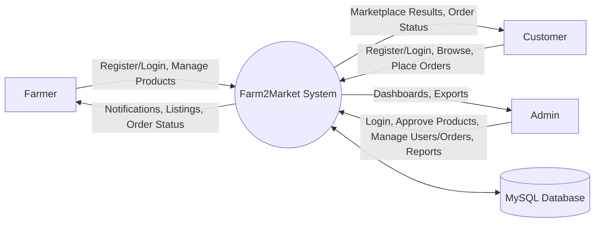

#### DFD — Level 1 (Major Processes)
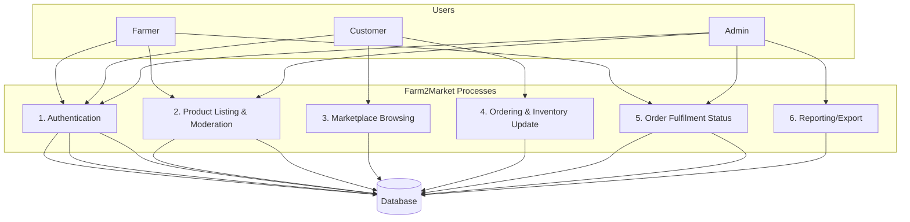

---

### 3.2 Entity Relationship Diagram (Page 09)

#### Main Entities
The main entities used in the Farm2Market database are administrator records, farmer records, customer records, product listings, procurement orders, and optional report records. These entities are connected through foreign keys so that products are associated with farmers, orders are associated with customers and products, and fulfilment responsibility is associated with the farmer who owns the product.

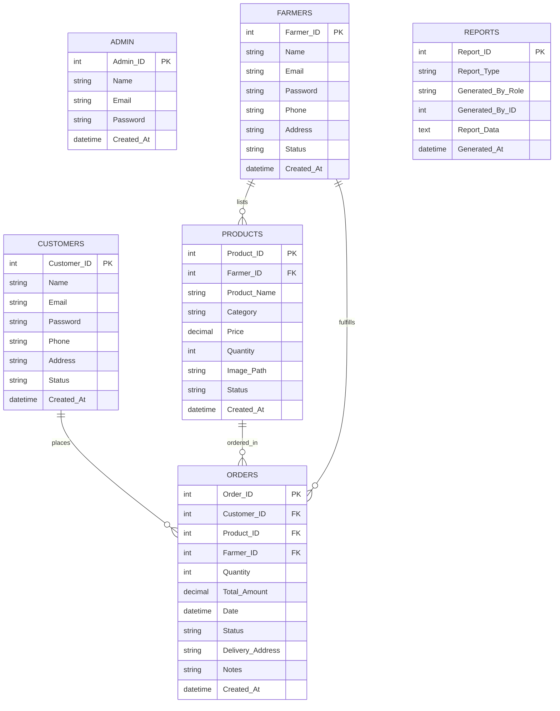

---

### 3.3 File Specifications (Page 10)
The database schema consists of several interconnected tables that ensure detailed record keeping and referential integrity for the Farm2Market marketplace system. Each table is designed with specific primary and foreign keys to maintain a normalized data structure. Along with the database, the project follows a modular PHP file structure where each role has its own directory and each functional area is implemented as a separate page file.

#### Table Name: `admin`
Purpose: Stores authentication data for system administrators who manage users, product approvals, orders, and reports.

| Field name | Data type | Size | Constraints | Description |
|---|---|---:|---|---|
| Admin_ID | INT | 11 | Primary Key, Auto Increment | Unique administrator identifier |
| Name | VARCHAR | 100 | Not Null | Administrator name |
| Email | VARCHAR | 191 | Unique, Not Null | Login email address |
| Password | VARCHAR | 255 | Not Null | Hashed password |
| Created_At | TIMESTAMP | - | Default Current Timestamp | Record creation time |

#### Table Name: `farmers`
Purpose: Stores authentication and profile data for registered farmers who publish products and fulfil orders.

| Field name | Data type | Size | Constraints | Description |
|---|---|---:|---|---|
| Farmer_ID | INT | 11 | Primary Key, Auto Increment | Unique farmer identifier |
| Name | VARCHAR | 100 | Not Null | Farmer name |
| Email | VARCHAR | 191 | Unique, Not Null | Login email address |
| Password | VARCHAR | 255 | Not Null | Hashed password |
| Phone | VARCHAR | 20 | - | Contact number |
| Address | TEXT | - | - | Location/address details |
| Status | ENUM | - | Default 'active' | Account status (active/blocked) |
| Created_At | TIMESTAMP | - | Default Current Timestamp | Record creation time |

#### Table Name: `customers`
Purpose: Stores authentication and profile data for customers who browse products and place orders.

| Field name | Data type | Size | Constraints | Description |
|---|---|---:|---|---|
| Customer_ID | INT | 11 | Primary Key, Auto Increment | Unique customer identifier |
| Name | VARCHAR | 100 | Not Null | Customer name |
| Email | VARCHAR | 191 | Unique, Not Null | Login email address |
| Password | VARCHAR | 255 | Not Null | Hashed password |
| Phone | VARCHAR | 20 | - | Contact number |
| Address | TEXT | - | - | Customer address |
| Status | ENUM | - | Default 'active' | Account status (active/blocked) |
| Created_At | TIMESTAMP | - | Default Current Timestamp | Record creation time |

#### Table Name: `products`
Purpose: Maintains product listings published by farmers and moderated by administrators before marketplace visibility.

| Field name | Data type | Size | Constraints | Description |
|---|---|---:|---|---|
| Product_ID | INT | 11 | Primary Key, Auto Increment | Unique product identifier |
| Farmer_ID | INT | 11 | Foreign Key | References `farmers.Farmer_ID` |
| Product_Name | VARCHAR | 200 | Not Null | Product title/name |
| Category | ENUM | - | Not Null | Product category |
| Price | DECIMAL | 10,2 | Not Null | Price per unit |
| Quantity | INT | 11 | Not Null | Available stock units |
| Description | TEXT | - | - | Product description |
| Image_Path | VARCHAR | 255 | - | Image filename/path |
| Status | ENUM | - | Default 'pending' | Listing state (pending/approved/rejected) |
| Created_At | TIMESTAMP | - | Default Current Timestamp | Record creation time |

#### Table Name: `orders`
Purpose: Stores procurement transactions between customers and farmers including delivery and fulfilment status.

| Field name | Data type | Size | Constraints | Description |
|---|---|---:|---|---|
| Order_ID | INT | 11 | Primary Key, Auto Increment | Unique order identifier |
| Customer_ID | INT | 11 | Foreign Key | References `customers.Customer_ID` |
| Product_ID | INT | 11 | Foreign Key | References `products.Product_ID` |
| Farmer_ID | INT | 11 | Foreign Key | References `farmers.Farmer_ID` |
| Quantity | INT | 11 | Not Null | Ordered units |
| Total_Amount | DECIMAL | 10,2 | Not Null | Computed order total |
| Date | DATETIME | - | Default Current Timestamp | Order date/time |
| Status | ENUM | - | Default 'placed' | placed/confirmed/ready/delivered/cancelled |
| Delivery_Address | TEXT | - | - | Delivery address |
| Notes | TEXT | - | - | Customer notes |
| Created_At | TIMESTAMP | - | Default Current Timestamp | Record creation time |

#### Table Name: `reports`
Purpose: Stores report metadata and optional stored report payloads, while the UI also supports on-demand CSV exports.

| Field name | Data type | Size | Constraints | Description |
|---|---|---:|---|---|
| Report_ID | INT | 11 | Primary Key, Auto Increment | Unique report identifier |
| Report_Type | ENUM | - | Not Null | sales/products/users/monthly |
| Generated_By_Role | ENUM | - | Not Null | admin/farmer/customer |
| Generated_By_ID | INT | 11 | Not Null | Generator user id |
| Report_Data | TEXT | - | - | Stored report data payload |
| Generated_At | TIMESTAMP | - | Default Current Timestamp | Report generation time |

#### File Structure Summary (Implementation Files)
The PHP implementation is organized so that shared configuration and UI elements are reused across pages, while each role is grouped into its own module directory. The entry point `index.php` serves as the landing interface, `db.php` provides the PDO connection and shared helpers, the `auth/` folder contains login and registration flows, the `includes/` folder contains session enforcement and layout, the `admin/`, `farmer/`, and `customer/` folders contain role-specific screens, and the `setup/` and seeding scripts support database initialization and demo data generation. Product images uploaded by farmers are stored inside `uploads/products/`.

---

### 3.4 Module Specifications (Page 14)
The system architecture is divided into several modules to handle specific administrative and operational tasks. Each module is designed to interact with the core database while providing a seamless user interface for the respective role. In Farm2Market, the module division is based on user responsibility and the workflow of listing, moderation, procurement, and fulfilment.

#### Modules List
The module list of Farm2Market includes user authentication and session management, an administrator console for user/product/order management and reporting, a farmer inventory module for product management, a farmer fulfilment module for order processing, a customer marketplace module for browsing and product details, a customer procurement module for order placement and tracking, and a reporting/export module that generates analytics outputs in CSV format.

#### USER AUTHENTICATION AND SESSION MANAGEMENT
This module handles secure login and logout for all roles by verifying hashed passwords against the database and initializing sessions with the correct role identity. Role-based access is enforced so that each page is accessible only to authorized users, and blocked accounts are prevented from starting sessions where applicable. The module also supports farmer/customer registration by validating input fields, hashing passwords, creating user records, and redirecting the user to the correct dashboard after successful onboarding.

#### ADMINISTRATOR CONSOLE (USERS, PRODUCTS, ORDERS, REPORTS)
The administrator console provides system-wide oversight of all marketplace activity. It allows the administrator to manage farmers and customers by viewing account details, blocking or activating accounts, and deleting accounts when required. It also provides product moderation features where farmer listings are reviewed and moved through pending, approved, or rejected states before they appear in the customer marketplace. In addition, the administrator can monitor and override order status for logistics supervision and can generate analytics exports such as sales summaries and category distribution reports in CSV format.

#### FARMER INVENTORY MODULE (PRODUCT MANAGEMENT)
This module enables farmers to publish products into the marketplace by entering product name, category, price, available quantity, description, and optionally uploading an image. Newly added products are stored with a pending approval state so that administrative moderation can be applied. The module also supports editing and deleting existing products, and any modifications made to an approved product will reset its status back to pending to ensure that customers only see verified information. Uploaded images are stored in the dedicated uploads directory and are referenced through stored paths.

#### FARMER FULFILMENT MODULE (ORDER PROCESSING)
The fulfilment module allows farmers to view procurement requests placed by customers for products owned by that farmer. Farmers can filter orders by status, view delivery coordinates and customer contact information, and update the fulfilment pipeline by marking orders as confirmed, ready, delivered, or cancelled based on operational conditions. This module ensures that farmers have a clear and trackable view of their active delivery pipeline and completed transactions.

#### CUSTOMER MARKETPLACE MODULE (BROWSE/SEARCH/DETAILS)
The customer marketplace module provides a catalog view that displays only approved products with available stock. Customers can apply category filters, execute keyword searches by product name or farmer name, and open a product detail screen to view price, stock, description, and provider information. The module is designed to simplify discovery while keeping product presentation consistent and moderated.

#### CUSTOMER PROCUREMENT MODULE (ORDER PLACEMENT AND TRACKING)
This module handles order placement by allowing customers to choose a valid quantity and submit delivery address details and optional notes. The system calculates the total amount based on unit price and quantity and records the order into the database. Inventory accuracy is maintained by executing the order process inside a database transaction with row-level locking, preventing oversell when concurrent requests occur. Customers can track the status of their orders in an archive screen and are allowed to cancel only when the order is still in the placed state, in which case stock is restored.

#### REPORTING AND EXPORT MODULE (CSV ANALYTICS)
The reporting module provides analytics outputs for administrative monitoring and documentation. Reports include monthly revenue matrices, category distribution summaries, and user activity status summaries. Exports are generated as CSV files to enable easy printing, analysis, and integration with spreadsheet tools, supporting institutional record keeping and decision making.

---

## CHAPTER 4 — TESTING AND IMPLEMENTATION (Page 16)

### 4.1 System Testing (Page 16)
System testing was performed to ensure that Farm2Market functions correctly at component level and as an integrated marketplace workflow. Individual forms were validated for required fields, password rules, and safe handling of file uploads, while page access was tested to confirm that role-based authorization prevents unauthorized access. Integration testing focused on confirming that the full workflow operates smoothly from farmer listing creation to administrator approval, customer browsing, order placement, inventory reduction, and farmer fulfilment updates. Database integrity testing verified that foreign key relationships remain valid and that order placement does not oversell inventory because the stock update is executed inside a transaction with row-level locking.

To document the testing process, representative test scenarios were executed, including successful logins for each role, blocked account login rejection, product creation with default pending state, administrative approval enabling marketplace visibility, quantity validation preventing orders above available stock, concurrency protection for last-stock purchases, cancellation rules that allow cancellation only while an order is in placed state, and status-lock behavior that prevents customers from cancelling after confirmation. The observed results matched expected behavior, confirming functional correctness and workflow consistency.

---

### 4.2 Implementation (Page 18)
The implementation phase focuses on converting the design into a working web application by creating the database schema, building role-based PHP modules, and integrating them with a unified user interface. The database is implemented on MySQL/MariaDB in the XAMPP environment, where structured table definitions are executed to create the normalized tables required for administrators, farmers, customers, products, orders, and optional reports. Primary keys uniquely identify each record and foreign keys maintain referential integrity between products, farmers, customers, and orders. The order-placement workflow is implemented using transaction control and row-level locking to maintain correct inventory values under concurrent access.

The backend is implemented in PHP using PDO for database connectivity and prepared statements for secure query execution. User authentication uses password hashing and session management for role-based access control, and access enforcement is applied across role pages using a shared session-check include. The frontend is implemented using HTML, CSS, and JavaScript, providing responsive dashboards and role-specific navigation. Product image uploads are handled on the farmer side with file type and file size validation, and files are stored in the designated uploads directory.

Deployment is performed locally using XAMPP. After placing the project directory under the Apache `htdocs` folder, Apache and MySQL services are started. The database schema can then be initialized by opening the installer page `setup/install.php`, and a richer dataset for demonstration can be inserted by running `seed_data.php` where required. Once installed, the application can be accessed through the landing page `index.php`, and users can log in using seeded credentials such as the administrator account `admin@farm2market.com` with password `admin123`, a farmer account such as `anbarasu@farm.com` with password `password123`, and a customer account such as `karthik@buyer.com` with password `password123`.

---

## CHAPTER 5 — CONCLUSION AND SUGGESTIONS (Page 20)

### 5.1 Conclusion (Page 20)
Farm2Market successfully provides a moderated role-based marketplace that enables farmers to list produce and customers to procure items directly through a structured digital workflow. The system maintains data accuracy and integrity through a normalized relational schema with enforced relationships between users, products, and orders, and it ensures correct inventory values by processing order placement through transaction-safe updates. The administrator module strengthens reliability by controlling product visibility through approvals, enforcing user discipline through block/activate actions, supervising the full order pipeline, and enabling practical reporting outputs for marketplace monitoring. Overall, the project demonstrates that a locally deployable PHP-MySQL system can modernize agricultural procurement workflows by improving transparency, traceability, and operational efficiency.

### 5.2 Suggestions for Future Enhancement (Page 20)
Future enhancement possibilities include introducing a multi-item cart so that customers can purchase multiple products in a single consolidated checkout, along with improved delivery scheduling features such as time-slot selection and dispatch tracking. The platform can be extended to support digital payment gateways and invoice generation for more formal procurement records. A structured audit log system can also be introduced to record administrative actions such as approvals, rejections, user blocks, and order overrides, thereby improving governance and accountability. Additional user-facing features such as product ratings, reviews, and dispute handling can improve marketplace trust, and generated report outputs can be stored persistently in the reports table for historical comparison rather than being limited to on-demand exports.

---

## BIBLIOGRAPHY (Page 21)
The PHP official documentation was referred for implementing PDO connectivity, password hashing, and session handling. MySQL/MariaDB documentation was referenced for relational schema design, foreign key constraints, and transaction concepts such as row-level locking used during order placement. OWASP web security guidance was used as a reference for secure authentication practices and safe input handling principles.

---

## APPENDICES (Page 22)

## APPENDIX – A (SCREEN FORMATS) (Page 22)

### A1. Authentication Page (Page 22)
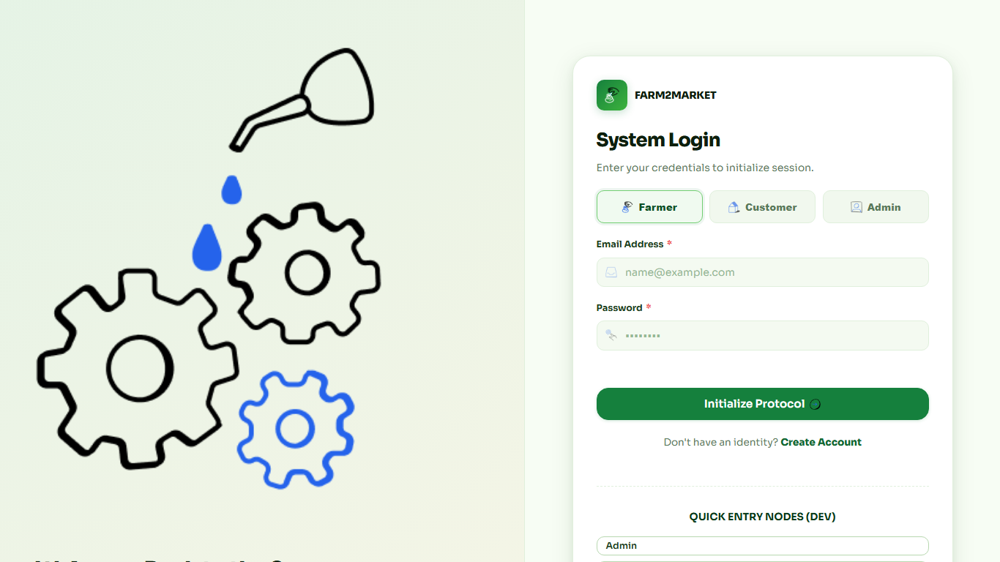

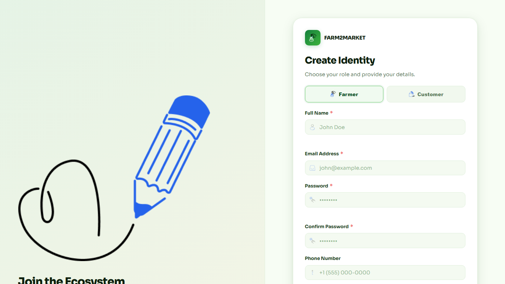

### A2. Admin Dashboard and Users (Page 22)
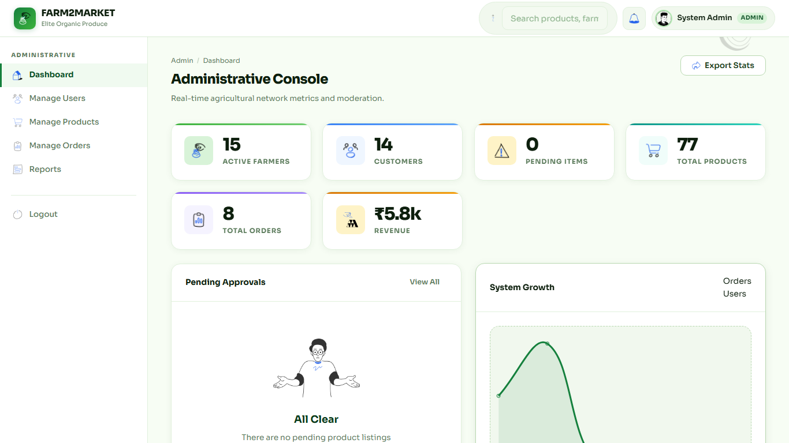

### A3. Products and Moderation (Page 23)
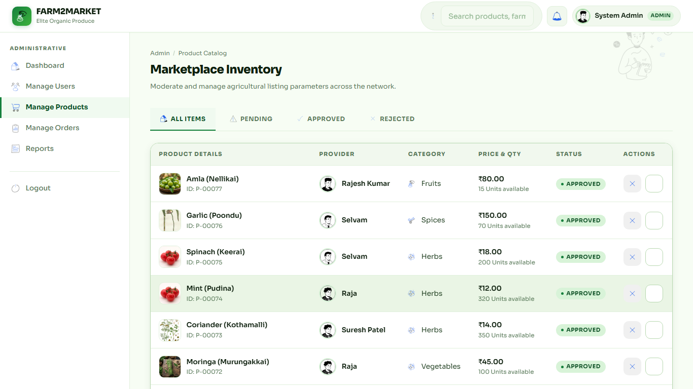

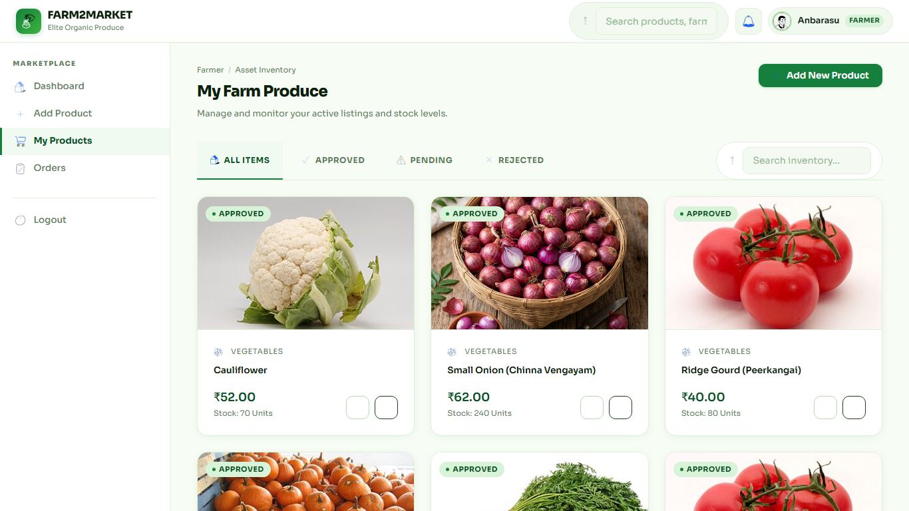

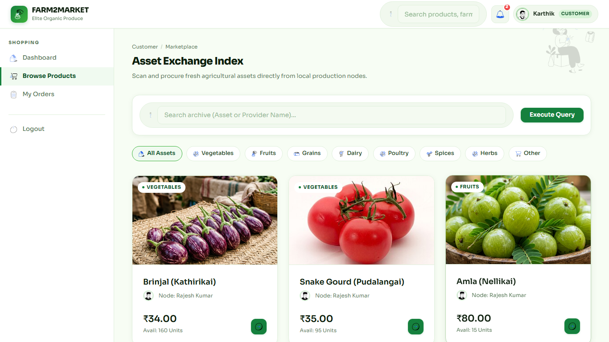

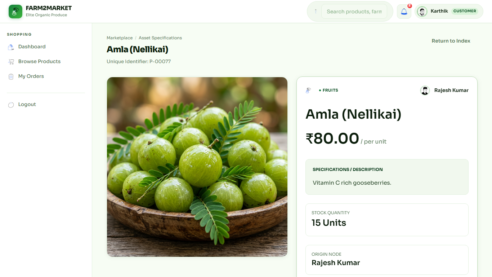

### A4. Orders and Matches (Page 25)
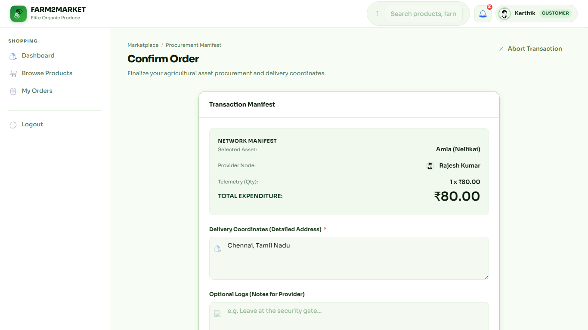

---

## APPENDIX – B (REPORT FORMS) (Page 26)

### Report 1 — Sales Analytics (Page 26)
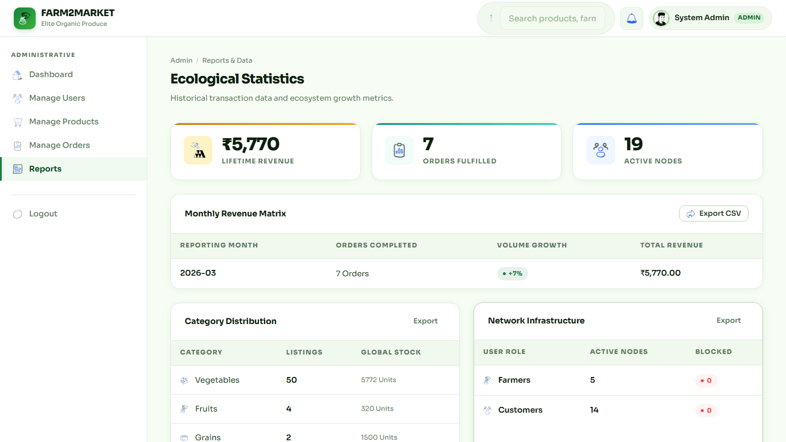

### Report 2 — Product Distribution (Page 26)

### Report 3 — User Status Summary (Page 27)

### Report 4 — Farmer Sales and Fulfilment Summary (Page 27)

