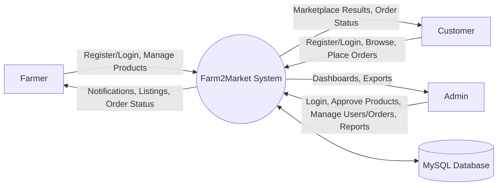
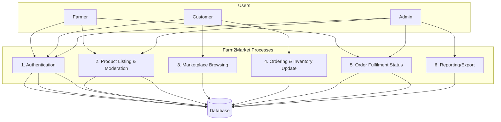
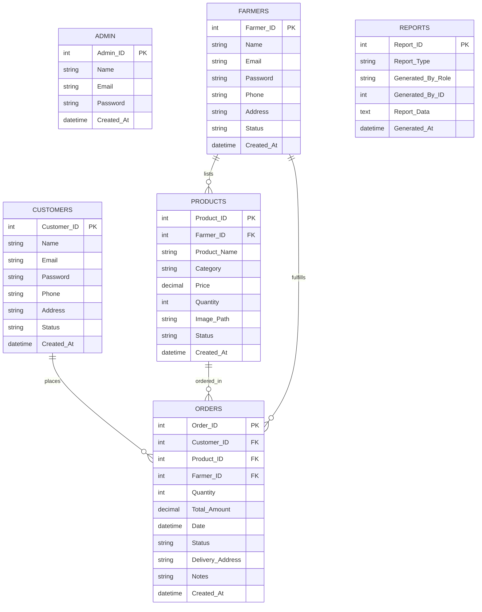

# COMPLETE PROJECT REPORT
## FARM2MARKET — Direct Farmer to Customer Marketplace (PHP + MySQL)

### ACKNOWLEDGEMENT (Page I)
I express my sincere gratitude to my project guide and faculty members for their valuable guidance and continuous support throughout this project. I also thank my friends and family for encouraging me during the development and documentation of this work.

### SYNOPSIS (Page II)
**Farm2Market** is a role-based web application that connects farmers directly with customers to enable transparent pricing, faster access to fresh produce, and reduction of middlemen. The system provides three dedicated interfaces (Admin, Farmer, Customer) with secure authentication, product listing with administrative approval, marketplace browsing with filters, ordering with inventory locking, and order-status tracking.

The project is implemented using **PHP (PDO)**, **MySQL (XAMPP/MariaDB)**, and a responsive UI built with **HTML/CSS/JS**. It runs on a local machine or LAN environment and supports data seeding for demo/testing.

---

## CONTENTS

| CHAPTER | TITLE | PAGE NO. |
|---:|---|---:|
|  | ACKNOWLEDGEMENT | I |
|  | SYNOPSIS | II |
| 1 | INTRODUCTION | 01 |
|  | 1.1 About the Project | 01 |
|  | 1.2 Hardware Specifications | 02 |
|  | 1.3 Software Specifications | 03 |
| 2 | SYSTEM ANALYSIS | 04 |
|  | 2.1 Problem Definition | 04 |
|  | 2.2 System Study | 05 |
|  | 2.3 Proposed System | 06 |
| 3 | SYSTEM DESIGN | 08 |
|  | 3.1 Data Flow Diagram (DFD) | 08 |
|  | 3.2 Entity Relationship Diagram | 09 |
|  | 3.3 File Specifications | 10 |
|  | 3.4 Module Specifications | 14 |
| 4 | TESTING AND IMPLEMENTATION | 16 |
|  | 4.1 System Testing | 16 |
|  | 4.2 Implementation | 18 |
| 5 | CONCLUSION AND SUGGESTIONS | 20 |
|  | 5.1 Conclusion | 20 |
|  | 5.2 Suggestions for Future Enhancement | 20 |
|  | BIBLIOGRAPHY | 21 |
|  | APPENDICES | 22 |
|  | APPENDIX – A (SCREEN FORMATS) | 22 |
|  | APPENDIX – B (REPORT FORMS) | 26 |

---

## CHAPTER 1 — INTRODUCTION (Page 01)

### 1.1 About the Project (Page 01)
Farm2Market is a web-based direct marketplace system that establishes a controlled and transparent link between three participant roles: the Farmer who publishes agricultural products and manages inventory, the Customer who explores approved items and places orders with delivery details, and the Administrator who moderates listings, manages user access, monitors overall transactions, and produces analytical exports. The main intention of the project is to reduce dependency on intermediaries by providing a structured platform where the product information, order flow, and fulfilment status remain digitally traceable, thereby improving fairness, speed of communication, and operational accountability.

#### OBJECTIVES OF THE PROJECT
The objective of Farm2Market is to provide a secure role-based environment where farmers can list products with essential parameters such as category, price, stock quantity, description, and product image, while customers can browse verified products using search and category filters and complete procurement by submitting quantity requirements and delivery address information. Another key objective is to empower administrators with moderation controls so that product listings follow an approval pipeline (pending, approved, rejected), and to enable system-level management such as blocking or activating users, supervising orders, and exporting reports for sales and inventory distribution. Additionally, the system aims to maintain correct stock values by using transaction-safe updates during order placement and by restoring inventory when cancellations are allowed.

#### SCOPE OF THE PROJECT
The scope of the system covers authentication and session management for Admin, Farmer, and Customer roles, product lifecycle management for farmers (create, update, delete) with an approval workflow enforced by admins, customer marketplace operations (browse, search, view details, place order), and order tracking through a defined status pipeline. The scope also includes administrative controls for user management and logistics oversight, along with reporting features that generate CSV exports for sales summaries, category distribution, and user activity states. The project is intended to run reliably on a local XAMPP-based environment, making it suitable for institutional labs or LAN deployments.

---

### 1.2 Hardware Specifications (Page 02)
The application is optimized to run on standard institutional hardware without requiring specialized servers. The recommended configuration used for development and execution is as follows.

Processor	:	Intel(R) Core (TM) i5-8500 @ 3.00 GHz  
RAM		:	8 GB  
Hard Disk	:	256 GB SSD  
Monitor		:	19.5" Monitor  
Mouse		:	Logitech Mouse  
Keyboard	:	Logitech Keyboard  

---

### 1.3 Software Specifications (Page 03)
The project is built on the PHP–MySQL–Apache stack, using XAMPP for local deployment. The software requirements for running and maintaining the system are listed below.

Operating System	:	Windows 11  
Web Server		:	Apache HTTP Server  
Backend Language	:	PHP  
Database		:	MySQL  
Frontend Stack		:	HTML5, CSS3, JavaScript (Latest Standards)  
Local Dev Stack		:	XAMPP  
Browser			:	Chrome / Firefox / Edge  

---

## CHAPTER 2 — SYSTEM ANALYSIS (Page 04)

### 2.1 Problem Definition (Page 04)
In many local agricultural markets, farmers often depend on intermediaries to reach customers, and this dependency reduces the farmer’s profit share while also making the final pricing less transparent to the customer. Customers may not have direct visibility into the origin, availability, and pricing logic of produce, and farmers may not have reliable visibility into demand. As a result, order fulfilment becomes slower, communication becomes fragmented, and there is limited accountability when disputes occur. The core problem addressed by this project is to design and implement a simple, secure, and moderated digital system that can operate locally and enable direct transactions between farmers and customers while keeping records of listings, orders, and fulfilment status.

#### EXISTING SYSTEM
In the existing approach, agricultural procurement is largely handled through phone calls, physical marketplaces, brokers, or informal messaging, where product availability and pricing are communicated verbally and may change without proper tracking. Farmers maintain stock information manually, customers search for produce by visiting multiple vendors, and there is no unified repository that records product parameters, order requests, delivery details, and order completion history. Administrative oversight is typically limited to manual checks and lacks systematic controls such as approval workflows and user access moderation.

#### LIMITATIONS OF EXISTING SYSTEM
The existing method suffers from lack of centralized data management, which leads to duplicate efforts, inconsistent information, and difficulty in verifying the authenticity of listings. It is time-consuming for customers to identify reliable sources and for farmers to reach multiple customers. Since order histories and fulfilment actions are not digitally tracked, it becomes difficult to analyze demand patterns, revenue trends, or inventory distribution. The absence of formal role separation and access control can also increase misuse and reduces the ability to enforce marketplace discipline.

---

### 2.2 System Study (Page 05)
The system study focuses on assessing feasibility and determining whether the proposed solution is practical within the available time, cost, and infrastructure constraints. Farm2Market is structured as a lightweight PHP-MySQL web application deployed on XAMPP, which makes it suitable for institutional laboratory environments and local intranet usage. The study also observes the operational needs of each role and ensures that the proposed workflow addresses the real pain points found in the existing system.

#### TECHNICAL FEASIBILITY
Technically, the system is feasible because it is built using stable and widely supported technologies such as PHP, MySQL, Apache, HTML, CSS, and JavaScript. The architecture uses PDO for secure database interaction, server-side session handling for role-based access control, and structured modules for each user role. The system can be executed entirely on a single local machine or hosted within a LAN through Apache, and the database schema uses normalized relational design with foreign keys to maintain data consistency. File upload requirements are minimal and limited to product images, which are stored in a controlled uploads directory.

#### ECONOMIC FEASIBILITY
Economically, Farm2Market is feasible because it uses open-source tools and a low-cost deployment approach. XAMPP, PHP, and MySQL are freely available, and development can be performed on existing institutional computers without additional hardware investment. The cost of implementation is mainly related to time spent in development, testing, and training, while the operational cost remains low as the system can run on commodity hardware.

#### OPERATIONAL FEASIBILITY
Operationally, the system is feasible because it matches the day-to-day workflow of farmers and customers while keeping the interface simple and role-specific. Farmers interact mainly with product listing and order fulfilment screens, customers interact with browsing and order placement screens, and administrators interact with moderation and reporting screens. Since the system provides clear navigation and consistent form validation, it can be adopted with minimal training, and the moderation pipeline improves trust and accountability in marketplace operations.

---

### 2.3 Proposed System (Page 06)
The proposed system is a controlled agricultural marketplace that digitizes the full workflow from listing to fulfilment. Users authenticate through role-based login, and new farmer/customer accounts can be created through registration. Farmers can add products which enter a pending state, and administrators approve or reject these listings before they become visible in the customer marketplace. Customers browse only approved items with available stock, place orders by selecting quantity and providing delivery coordinates, and the system records each transaction with a defined status pipeline. To protect inventory accuracy, order placement is implemented using database transactions and row locking so that overselling is avoided when multiple users attempt to buy the same limited stock item. Administrative reporting tools provide exports for sales summaries, category distribution, and user activity status.

#### ADVANTAGES OF PROPOSED SYSTEM
The proposed system improves transparency because product visibility is governed by an approval workflow and customers see consistent pricing and stock values. It reduces dependence on intermediaries by supporting direct procurement between farmers and customers. It improves accountability through traceable order history and fulfilment status updates. Finally, it strengthens administrative control by enabling user moderation, product moderation, and system-level analytics exports, all of which contribute to a safer and more reliable marketplace.

---

## CHAPTER 3 — SYSTEM DESIGN (Page 08)

### 3.1 Data Flow Diagram (DFD) (Page 08)

#### DFD — Level 0 (Context Diagram)

#### DFD — Level 1 (Major Processes)

---

### 3.2 Entity Relationship Diagram (Page 09)

#### Main Entities
- **admin**
- **farmers**
- **customers**
- **products**
- **orders**
- **reports** (optional storage for generated reports; exports are generated dynamically in UI)

---

### 3.3 File Specifications (Page 10)

#### Root files
- **`index.php`**: Landing page; shows featured approved products; prompts login/register.
- **`db.php`**: PDO connection to MySQL `farm2market_db`; defines `BASE_URL`, asset constants, and helpers (`avatar()`, `catIcon()`, `productImageSrc()`).
- **`seed_data.php`**: Seeder runner (creates demo admin/farmers/customers/products if missing).
- **`COMPLETE_PROJECT_REPORT.md`**: This report.

#### `auth/`
- **`auth/login.php`**: Role-based login (admin/farmer/customer); checks blocked status for farmer/customer; redirects to role dashboard.
- **`auth/register.php`**: Registration for farmer/customer; stores hashed password and starts session.
- **`auth/logout.php`**: Ends session and redirects.

#### `includes/`
- **`includes/session_check.php`**: Session enforcement + role authorization.
- **`includes/header.php`**: Shared UI layout; role-based sidebar; notification feed.
- **`includes/footer.php`**: Closes layout; loads JS; notification panel toggle.

#### `admin/`
- **`admin/dashboard.php`**: Global stats; recent orders; quick approve/reject for pending products.
- **`admin/manage_users.php`**: Lists farmers/customers; block/unblock; delete user.
- **`admin/manage_products.php`**: View/filter products; approve/reject/delete.
- **`admin/manage_orders.php`**: View/filter orders; override statuses.
- **`admin/reports.php`**: Analytics tables; CSV export endpoints (sales/products/users).

#### `farmer/`
- **`farmer/dashboard.php`**: Farmer stats; recent products; recent orders.
- **`farmer/add_product.php`**: Create listing with optional image upload; new listings are `pending`.
- **`farmer/my_products.php`**: View/filter own listings; delete listing; edit navigation.
- **`farmer/edit_product.php`**: Update listing; resets status to `pending`; image replace supported.
- **`farmer/my_orders.php`**: View/filter orders for this farmer; update status; cancel.

#### `customer/`
- **`customer/dashboard.php`**: Customer stats; recent orders; recommended products.
- **`customer/browse.php`**: Browse approved products; filter by category; search by product/farmer.
- **`customer/product_detail.php`**: View details; start order with quantity.
- **`customer/place_order.php`**: Transaction-safe order creation; decrements stock; captures delivery address/notes.
- **`customer/my_orders.php`**: View/filter orders; cancel only when status is `placed` (restores stock).

#### `setup/`
- **`setup/install.php`**: Creates database and tables; seeds initial minimal demo data if needed.
- **`setup/seed_data.php`**: Alternate seeding script with Tamil Nadu sample entries.
- **`setup/verify_seed.php`**: Seed verification page (if present in your repo).

#### `uploads/`
- **`uploads/products/`**: Stores farmer-uploaded product images.

---

### 3.4 Module Specifications (Page 14)

#### Admin Module
- **Login**: Admin role authenticates via `admin` table.
- **User management**: Block/unblock or delete farmers/customers.
- **Product moderation**: Approve/reject pending products; delete listings.
- **Order control**: View all orders; override status (logistics control).
- **Reports**: Export CSV for sales, products distribution, and user status.

#### Farmer Module
- **Profile (implicit)**: Session-based identity from `farmers` table.
- **Product management**: Add/edit/delete products; uploads saved to `uploads/products/`; status resets to pending on edit.
- **Order fulfilment**: View orders; update status; cancel if required.

#### Customer Module
- **Marketplace**: Browse/search approved products with stock > 0.
- **Order placement**: Quantity validation; DB transaction with row-lock to prevent race conditions.
- **Order archive**: Track order status; cancellation only when `placed` (inventory restored).

---

## CHAPTER 4 — TESTING AND IMPLEMENTATION (Page 16)

### 4.1 System Testing (Page 16)

#### Testing types performed
- **Unit-level checks**: Form validations (required fields, password match, file type/size).
- **Integration testing**: End-to-end flow across modules (list → approve → browse → order → fulfil).
- **Security testing (basic)**: Session checks, role authorization, blocked user login restriction.
- **Database integrity**: Foreign keys and transaction-based stock updates.

#### Sample test cases
| Test Case ID | Scenario | Expected Result |
|---|---|---|
| TC-01 | Login with valid admin credentials | Redirect to `admin/dashboard.php` |
| TC-02 | Blocked farmer tries to login | Show “Account is blocked” |
| TC-03 | Farmer adds product | Product created with `Status='pending'` |
| TC-04 | Admin approves product | Product appears in customer marketplace |
| TC-05 | Customer orders qty \> stock | Order prevented; error shown |
| TC-06 | Two customers order same last-stock item | Only one succeeds (row lock prevents oversell) |
| TC-07 | Customer cancels “placed” order | Order status becomes cancelled and stock restored |
| TC-08 | Customer cancels “confirmed” order | Cancellation denied (status locked) |

---

### 4.2 Implementation (Page 18)

#### Installation / Setup steps (XAMPP)
1. Place project folder in `htdocs/` (already done: `Farm2Market/`).
2. Start **Apache** and **MySQL** in XAMPP.
3. Initialize database schema by opening:
   - `setup/install.php` (creates `farm2market_db` + tables and inserts minimal sample data)
4. (Optional) Seed larger demo dataset by opening:
   - `seed_data.php` (adds many farmers/customers/products if not present)
5. Open the system landing page:
   - `index.php`

#### Default demo credentials (as seeded)
- **Admin**: `admin@farm2market.com` / `admin123`
- **Farmer** (example): `anbarasu@farm.com` / `password123`
- **Customer** (example): `karthik@buyer.com` / `password123`

---

## CHAPTER 5 — CONCLUSION AND SUGGESTIONS (Page 20)

### 5.1 Conclusion (Page 20)
Farm2Market successfully provides a moderated, role-based marketplace that enables farmers to list produce and customers to procure products directly. The system maintains data integrity using relational schema constraints and inventory-safe transactions during ordering, while the admin module ensures control and reliability through approvals, user moderation, and reporting.

### 5.2 Suggestions for Future Enhancement (Page 20)
- Add **multi-item cart** and consolidated checkout (currently orders are per-product).
- Add **delivery scheduling** and dispatch tracking.
- Add **digital payments** and invoice generation.
- Add **audit logs** for admin actions (user blocks, approvals, overrides).
- Add **product reviews/ratings** and dispute workflow.
- Store generated reports into `reports` table for historical retrieval (currently CSV is generated on-demand).

---

## BIBLIOGRAPHY (Page 21)
- PHP Manual — PDO and sessions
- MySQL 8 / MariaDB Documentation — transactions and row locking
- OWASP guidelines for web application security (authentication/session handling)

---

## APPENDICES (Page 22)

## APPENDIX – A (SCREEN FORMATS) (Page 22)

### A1. Authentication Page (Page 22)
- `auth/login.php` (role-based login tabs)
- `auth/register.php` (farmer/customer registration)

### A2. Admin Dashboard and Users (Page 22)
- `admin/dashboard.php`
- `admin/manage_users.php`

### A3. Products and Moderation (Page 23)
- `admin/manage_products.php`
- `farmer/add_product.php`
- `farmer/my_products.php`
- `farmer/edit_product.php`
- `customer/browse.php`
- `customer/product_detail.php`

### A4. Orders and Matches (Page 25)
*(In this project, “Matches” corresponds to “Orders / Fulfilment Logs”.)*
- `customer/place_order.php`
- `customer/my_orders.php`
- `farmer/my_orders.php`
- `admin/manage_orders.php`

---

## APPENDIX – B (REPORT FORMS) (Page 26)

### Report 1 — Tournament Analytics (Page 26)
*(In this project, “Tournament Analytics” corresponds to **Monthly Revenue Matrix**.)*
- Source: `admin/reports.php` export `?export=sales`
- Output fields: Month, Total Orders, Total Revenue

### Report 2 — Performance Tracking (Page 26)
*(Corresponds to **Category Distribution**.)*
- Source: `admin/reports.php` export `?export=products`
- Output fields: Category, Product Count, Total Stock Available

### Report 3 — Participation Data (Page 27)
*(Corresponds to **Active/Blocked Users**.)*
- Source: `admin/reports.php` export `?export=users`
- Output fields: Role, Total Active, Total Blocked

### Report 4 — Athlete Statistics (Page 27)
*(Optional extension: per-farmer sales and fulfilment statistics can be added in future.)*
